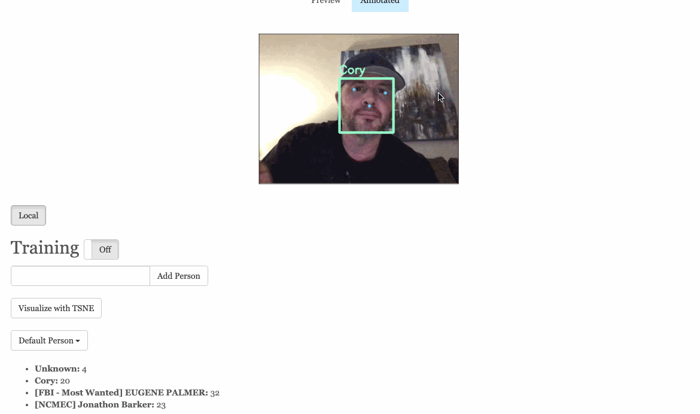

``` ____________
< identified >
 ------------
    \
     \
                                   .::!!!!!!!:.
  .!!!!!:.                        .:!!!!!!!!!!!!
  ~~~~!!!!!!.                 .:!!!!!!!!!UWWW$$$
      :$$NWX!!:           .:!!!!!!XUWW$$$$$$$$$P
      $$$$$##WX!:      .<!!!!UW$$$$"  $$$$$$$$#
      $$$$$  $$$UX   :!!UW$$$$$$$$$   4$$$$$*
      ^$$$B  $$$$\     $$$$$$$$$$$$   d$$R"
        "*$bd$$$$      '*$$$$$$$$$$$o+#"
             """"          """""""
```



###Identify.dev sets out to leverage http://www.missingkids.org/ and https://www.fbi.gov/wanted/topten to train facial recognition models used to use in both realtime and historical security, doorbell, etc... video to reduce the timeframe for finding missing persons.
